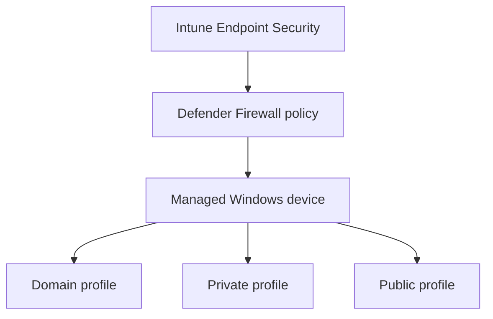

# Microsoft Defender Firewall Management

## Microsoft Intune Endpoint Security

A hands-on Microsoft lab demonstrating centralised deployment and verification of Windows Defender Firewall settings through Intune.

> **Lab environment:** This project was completed independently in a personal Microsoft lab. All identities, devices and configuration details are lab data.

## Project Summary

| Area | Implementation |
|---|---|
| Business requirement | Maintain firewall protection across managed Windows devices |
| Management platform | Microsoft Intune |
| Security control | Microsoft Defender Firewall |
| Network profiles | Domain, Private and Public |
| Assignment scope | Managed devices |

## Architecture

## Scenario

Individually configured endpoint firewalls can become inconsistent or be disabled. This project tested whether a standard firewall configuration could be centrally assigned to managed Windows devices and verified at both the management and endpoint layers.

## What I Implemented

### Policy Configuration

- Created a Microsoft Defender Firewall policy in Intune Endpoint Security
- Enabled firewall protection for Domain, Private and Public profiles
- Configured inbound traffic to be blocked by default
- Allowed outbound traffic by default

### Assignment and Verification

- Assigned the policy at device scope
- Reviewed Intune deployment status
- Confirmed active firewall profiles in Windows Security
- Verified that policy remained applied independently of the signed-in user

## Validation Results

| Test | Expected result | Observed result |
|---|---|---|
| Policy assigned to managed device | Intune reports successful deployment | Deployment succeeded |
| Inspect Windows Security | All required firewall profiles are enabled | Profiles enabled |
| Review traffic defaults | Inbound blocked and outbound allowed | Configuration confirmed |

## Outcome

The lab demonstrated centralised firewall management using Intune and confirmed that consistent protection could be applied across all Windows network profiles.

## Skills Demonstrated

- Microsoft Intune
- Endpoint Security policies
- Microsoft Defender Firewall
- Device-based assignment
- Windows Security
- Policy verification
- Security baselines

## Technical Documentation

[View the full technical documentation (PDF)](https://github.com/guyleonchen/Intune-Defender-Firewall-Management/blob/main/Lab8.pdf)

---

[Return to Guy Cheneval's GitHub profile](https://github.com/guyleonchen)
